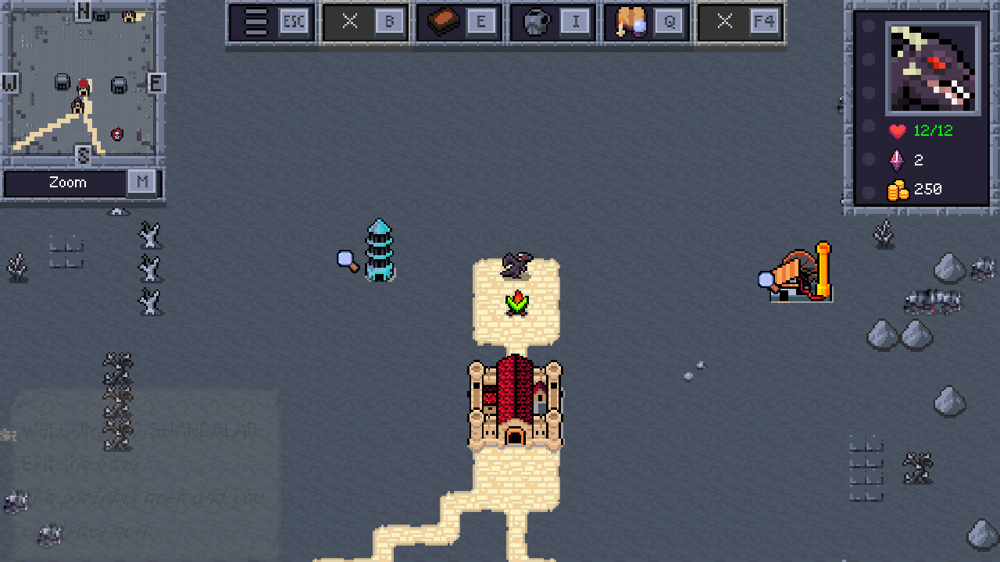

# Shandalar

[Forge](https://github.com/Card-Forge/forge)'s Adventure mode, the single-player Magic: The
Gathering RPG, running in a web browser. The Java game (libGDX) is compiled to JavaScript with
[gdx-teavm](https://github.com/xpenatan/gdx-teavm) and [TeaVM](https://teavm.org) 0.15, with as
few changes to Forge as possible.

**Play it at <https://cosmicscribe64.github.io/shandalar/>** in desktop Chrome. The first visit
downloads about 30 MB, and the game needs about 1.1 GB of memory once you're in the world.



## Status

It's experimental. The hosted copy is rebuilt from source for each release.

You can play it from start to finish in Chrome: the tutorial, world generation, the overworld,
towns and shops, duels against Forge's AI, and saves that persist across reloads. It has been
tested in desktop Chrome and headless Chromium. Other browsers are untested.

Numbers as of 2026-09-29 (conditions and history are in
[`wiki/status/metrics.md`](wiki/status/metrics.md)):

| Measure | Value |
|---|---|
| `app.js` size | 76 MB, 7.1 MB gzipped |
| Page load to title screen | about 18 s |
| World generation | 6.6 s (it was 44-70 s) |
| Browser memory at the overworld | about 1.1 GB |

The goal is for Adventure to run well on phones. [`PLAN.md`](PLAN.md) has the plan, and
[`wiki/status/open-issues.md`](wiki/status/open-issues.md) lists the known problems.

## How it works

Forge is pinned to one upstream commit, named in [`FORGE_COMMIT`](FORGE_COMMIT), and every
change to it is in a single patch file, [`patches/forge-web.patch`](patches/forge-web.patch).
Most of those changes are meant to go upstream.

TeaVM compiles Forge and its dependencies to JavaScript in `web/`, a Gradle project. TeaVM is
missing parts of the JDK that Forge needs, such as blocking concurrency, XML, object streams and
text handling. This project supplies them through its own class library, a substitution policy
and a compiler plugin, all in `web/src/main/java`.

Forge blocks threads freely, which a browser can't do. Game code runs on TeaVM green threads
that share one UI thread, and world generation runs in Web Workers.

Forge's `res/` folder holds 466 MB of game data. The page fetches files from it over HTTP when
Forge first reads them, using a manifest of what exists. Card scripts and the files a new game
needs at startup come as a few gzipped downloads instead. Settings and saves are kept in
IndexedDB. Card art comes from [Scryfall](https://scryfall.com)'s API, as in the desktop game.

[`wiki/overview.md`](wiki/overview.md) has the full picture. The `wiki/` folder is an
[Obsidian](https://obsidian.md) vault, and its `[[links]]` work best there.

## Building

You need:

- Docker, with at least 8 GB of memory for its VM, because the TeaVM compile peaks at about
  6.7 GB. The JDK, Maven and Gradle run in a container ([`docker/Dockerfile`](docker/Dockerfile)),
  so you don't install any Java tools yourself.
- bash, git and Python 3.
- About 1 GB of disk for the Forge checkout and 1.5 GB for the build image, plus 3.5 GB for the
  Playwright image if you run the tests.

It's developed on macOS (Apple silicon) and should work on Linux. Windows is untested.

```bash
scripts/update-forge       # clone Forge at FORGE_COMMIT and apply patches/forge-web.patch
scripts/build-forge-libs   # build Forge's jars with Maven into web/libs
scripts/build-webdata      # pack Forge's game data for the web into web/webdata
scripts/build-web          # compile to JavaScript (about 5 min) into web/build/dist/js/webapp
scripts/serve-web          # serve it at http://localhost:8090 (set PORT to change)
```

Then open <http://localhost:8090/> in Chrome. These page parameters are useful for testing:

| Parameter | Effect |
|---|---|
| `?seed=N` | Generates the same world every time |
| `?test=1` | Turns on the in-game test harness (`forgeweb.test.WebTest`) |
| `?wfc=local` | Generates the world on the page instead of in Web Workers |

### Hosting

`scripts/build-site` puts the built game in `web/build/site` (about 310 MB) as a static site.
Any static host can serve it, from the root or from a subpath.
[`.github/workflows/pages.yml`](.github/workflows/pages.yml) runs every step above on GitHub's
servers and publishes the result to GitHub Pages whenever a release is published. You can also
run it by hand from the Actions tab.

Players' browsers fetch card art straight from Scryfall's API, which asks clients to stay under
about 10 requests per second.

## Development

| Script | What it does |
|---|---|
| `scripts/selftest` | Builds and runs a set of checks (`forgeweb.selftest.SelfTest`) in headless Chromium, without the game. Each check reproduces a bug once found in the game. It exits with 0 only if every check passes. |
| `scripts/webtest` | Drives a build in headless Chromium (Playwright, in Docker). [`web/tools/webtest.py`](web/tools/webtest.py) lists the steps it accepts. |
| `scripts/play-start`, `play`, `api` | Start a headless game session and send it commands from the shell through the test harness. |
| `scripts/measure` | Measures download size, startup time, world-generation time and memory for a fixed seed. |
| `scripts/wfc-golden` | Checks that the world-generation patches produce exactly the same output as upstream Forge. |
| `scripts/update-forge <ref>` | Moves to a newer Forge. See [`wiki/howto/update-forge.md`](wiki/howto/update-forge.md). |

For background, [`NOTES.md`](NOTES.md) is the lab notebook, with every round of fixes in order
and the measurements taken along the way. [`PLAN.md`](PLAN.md) is the architecture plan, with
phases and exit criteria. The [`wiki/`](wiki/index.md) explains how each part works and why it
was built that way, and it catalogues the TeaVM, gdx-teavm and Forge bugs found so far.

If you contribute, fix root causes instead of working around them, and change Forge only
through the patch, in a way that could go upstream. When the game hits a runtime bug, reproduce
it as a SelfTest check first, fix it there, and then run the full game build.

### Repository layout

| Path | What |
|---|---|
| `patches/forge-web.patch` | Every change to Forge |
| `web/src/main/java/forge/web` | The web launcher |
| `web/src/main/java/forgeweb` | The web layer: file system, threads, compatibility hooks, test harness and TeaVM plugins |
| `web/src/main/java/org/teavm/classlib` | JDK classes that TeaVM lacks or gets wrong |
| `web/src/main/java/emu`, `com/...` | Fixed copies of a few gdx-teavm, libGDX and TenPatch classes |
| `web/html/index.html` | The page: loading screen, prefetching and IndexedDB |
| `web/tools` | Test driver, static server and code generators |
| `scripts/` | Build, serve and test scripts. The heavy work runs in Docker. |
| `wiki/` | The project wiki |

## License

Shandalar is licensed under the [GPL-3.0](LICENSE), like Forge. The patch is a derivative of
Forge, and the compiled game contains Forge's code.

A few files are modified copies of code from other projects, and they keep their original
licenses and headers:

- `web/src/main/java/com/badlogic/gdx/graphics/g2d/NinePatch.java` comes from
  [libGDX](https://github.com/libgdx/libgdx) (Apache-2.0).
- `web/src/main/java/com/ray3k/tenpatch/TenPatchDrawable.java` comes from
  [TenPatch](https://github.com/raeleus/TenPatch) (MIT).
- `AsyncResult.java`, `Gdx2DPixmapNative.java` and `FreeType.java` under
  `web/src/main/java/emu/com/badlogic/gdx/` come from
  [gdx-teavm](https://github.com/xpenatan/gdx-teavm) (Apache-2.0).
- `TObject.java` and the `java/util/zip` classes under `web/src/main/java/org/teavm/classlib/`
  come from [TeaVM](https://github.com/konsoletyper/teavm) (Apache-2.0).

Forge's game data isn't in this repository. `scripts/update-forge` downloads it with the rest of
Forge. No card images are included either, because the game loads them from Scryfall while
you play.

## Disclaimer

Shandalar is an unofficial fan project. It is not affiliated with or endorsed by Wizards of the
Coast or the Forge team. Magic: The Gathering is a trademark of Wizards of the Coast LLC.

## Credits

Thanks to the [Forge](https://github.com/Card-Forge/forge) team for the game, to Xpenatan for
[gdx-teavm](https://github.com/xpenatan/gdx-teavm), to Alexey Andreev for
[TeaVM](https://github.com/konsoletyper/teavm), and to the [libGDX](https://libgdx.com) project.
